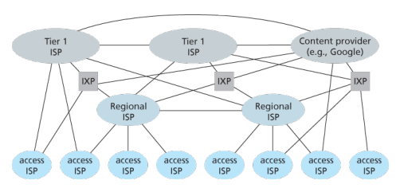
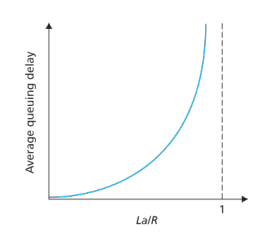

# 컴퓨터 네트워크와 인터넷

## 1.1 인터넷이란?

### 1.1.1 구성요소적 관점

- 인터넷 : 전 세계적으로 수십억 개의 컴퓨팅 장치를 연결하는 컴퓨터 네트워크
- 호스트(host), 종단 시스템(end system) : 사물인터넷, 스마트폰 등 모든 장치
- 통신 링크(communication Links) : 동축케이블, 구리선, 광케이블 등 물리매체
- 전송률(transmission rate, 링크 대역폭) : bps(bit per second) 단위를 사용하며, 한 종단시스템에서 다른 종단 시스템으로 보낼 데이터를 세그먼트(segment)로 나누고 헤더(header)를 붙여서 보냄
- 패킷(packet) : 위에서 서술한 세그먼트 + 헤더 = 패킷, 도착지에서 다시 조립함
- 패킷 스위치 (packet switch) : 라우터(router), 링크 계층 스위치(link-layer switch)로 나뉨, 최종 목적지로 패킷을 보냄
- ISP(Internet Service Provider) : 사용자가 인터넷에 접속할 수 있도록 인프라와 서비스 제공자. IP프로토콜을 수행함
- 프로토콜(protocol) : 정보의 송신과 전송을 제어할 수 있도록 미리 약속된 규약 및 규범
    - TCP(Transmission Control Protocol) : 클라이언트와 서버간의 통신을 위해 SYN, SYN-ACK, ACK의 3단계 (3-way handshake) 과정을 지정
    - IP(Internet Protocol) : 라우터와 종단 시스템간의 송수신되는 패킷의 형식을 지정한다.

### 1.1.2 서비스 측면적 관점

- 인터넷은 분산 애플리케이션을 지원하는 인프라
- 네트워크는 애플리케이션의 데이터 전달, 소켓(socket) 인터페이스로 통신

### 1.1.3 프로토콜이란 무엇인가?

둘 이상의 통신 개체 간의 교환되는 메시지 포맷과 순서뿐만 아니라, 메시지의 송수신과 다른 이벤트에 따른 행동들을 정의한다.

## 1.2 네트워크의 가장자리(network edge)

컴퓨팅 장치가 종단 시스템이라고 불리는 이유 : 바로 인터넷의 가장자리(Edge)에 연결되어 있기 때문

네트워크 엣지에 존재하는 구성 요소

- 컴퓨팅 장치에 포함되는 종단 시스템, 호스트(클라이언트, 서버, 데이터 센터)
- 접속 네트워크(Access networks)
- 링크(물리 매체) 등

### 1.2.1 접속 네트워크(access network)

접속 네트워크란, 종단 시스템을 첫 번째 라우터(가장자리 라우터, edge router)에 물리적으로 연결하는 네트워크를 의미한다.

- 가정 접속 : DSL, 케이블(HFC), FTTH, 5G
- 기업 접속 : 이더넷, 와이파이(Wi-Fi)
- 무선 접속 : 3G, LTE, 5G

### 1.2.2 물리 매체

- 유도매체(guided media) : 견고한 매체를 따라 파형을 유도 (진짜 전선을 타고 감)
    - 꼬임쌍선, 동축케이블, 광섬유
- 비유도매체(unguided media) : 대기와 야외공간으로 파형을 전파
    - 무선 LAN, 위성 라디오 채널

## 1.3 네트워크 코어

종단 시스템을 서로 연결하는 패킷 스위치(주로 라우터)와 링크들이 그물망(mesh)처럼 상호 연결된 네트워크의 중심부

### 1.3.1 패킷 교환 방식

대부분의 패킷 스위치는 저장 - 후 - 전달 전송(store-and-forward transmisson) 방식을 이용

전체 패킷이 라우터에 도착해야만 다음 링크를 통해 전송되는 방식

큐잉 지연(출력 링크가 보내는걸 기다림)과 패킷 손실(버퍼가 다 차면 라우터 방식에 따라서 랜덤으로 버려지거나 가장 오래된 패킷을 버려버림) 가능성 존재

**라우팅과 포워딩**

- **Routing** : 패킷이 소스에서 목적지 까지 이동할 경로를 결정
    - 라우팅 알고리즘으로 전체 네트워크의 상태와 구조를 파악하고 포워딩 테이블을 만듬
- **Forwarding** : 패킷을 라우터의 입력에서 적절한 라우터 출력으로 이동
    - 포워딩 테이블에서 검색해서 목적지에 패킷을 전달함

### 1.3.2 회선 교환 방식

출발지와 목적지의 통신 세션 지속 시간 동안 통신을 위해 필요한 경로(버퍼, 링크 전송률)의 자원이 예약되어 할당

- FDM(주파수 분할 다중화, Frequency Division Multiplexing)
    - 여러 신호를 다른 주파수에 실어 동시에 전송(병렬), 주로 아날로그, 가드 밴드 필요, 라디오·TV에 사용
- TDM(시분할 다중화, Time Division Multiplexing)
    - 여러 신호를 시간으로 나눠 순서대로 전송(직렬), 주로 디지털, 동기화 필요, 전화망·네트워크에 사용

**패킷 교환 VS 회선 교환**

책피셜 : 패킷 교환 우승

패킷 스위칭(packet switching)은 많은 사용자가 네트워크 자원을 효율적으로 공유할 수 있게 해주는 방식

별도의 회선 할당 없이, 데이터를 작은 패킷으로 쪼개서 필요할 때마다 보내기 때문에 자원을 효율적으로 사용하며, 많은 사용자가 동시에 통신할 수 있음.

하지만 패킷 스위칭은 패킷이 지연되거나 손실될 수 있기 때문에, 신뢰성 있는 전송 프로토콜(예: TCP)이 필요하고, 네트워크에 패킷이 너무 몰려서 혼잡이 생기는 것을 막기 위한 혼잡 제어가 필요.

**혼잡 제어(congestion control)**

네트워크에 너무 많은 패킷이 몰려서 지연이나 손실이 생기지 않도록 패킷의 전송 속도를 조절하는 기술.

밑에서 추가 서술

### 1.3.3 네트워크의 네트워크(network of network)

여러 독립적인 네트워크(특히 다양한 ISP)가 서로 연결되어 하나의 거대한 인터넷을 이루는 구조

ISP간 연결을 Peering Link라고 하며, KT, SKT, LG U+는 Level 2 ISP이다.

## 1.4 패킷 교환 네트워크에서의 지연, 손실과 처리율

### 1.4.1 패킷 교환 네트워크에서의 지연 개요

노드 처리 지연, 큐잉 지연, 전송 지연, 전파 지연을 통틀어 전체 노드 지연을 일으킴.

- 노드 처리 지연 : 헤더를 읽고 처리하는 시간
    - 마이크로초 이하
- 큐잉 지연 : 패킷이 다 도착 한 상태에서 → 앞에있던 패킷들이 다 나가길 기다리는 시간
    - 마이크로초에서 밀리초
- 전송 지연 : 패킷을 보내는데 걸리는 시간(라우터에 패킷이 다 와야 다음단계를 진행하니까)
    - 마이크로초에서 밀리초
- 전파 지연 : 링크 → 다음 라우터까지 도착하는 시간 (실제 거리에 따라 다름)
    - 링크의 물리매체마다 다른데, 빛의 속도와 같거나 약간 작음. 수 밀리초 정도

### 1.4.2 큐잉 지연과 패킷 손실

**큐잉 지연**

트래픽 강도 = 큐에 도착하는 데이터의 양 ÷ 큐가 처리할 수 있는 속도

1 넘게 설계하면 큐가 점점 쌓여서 패킷이 손실됨

트래픽 강도가 1에 가까울 수록 큐잉지연이 점점 늘어남

이때 혼잡제어가 하는 일 (큐에 도착하는 데이터 양을 조절해서 적당히 받게끔 함)

TCP 자체는 네트워크 상황에 따라 속도를 줄이거나 늘릴 뿐, 네트워크의 최대 속도를 늘려주지는 않는다.

큐잉 지연을 줄이는 것 뿐이고 처리속도가 늘어나지는 않음.

**패킷 손실**

트래픽 강도가 1이 넘어서 큐가 꽉차서 패킷을 버렸습니다.

TCP에서 패킷 도착 확인 문자(ACK)가 오지 않음을 인지하고 다시 보내줍니다.

### 1.4.3 종단 간 지연

총 종단 간 지연 = (처리 지연 + 큐잉 지연 + 전송 지연 + 전파 지연) × 경로상의 노드 수 + @

**Traceroute**

Traceroute는 인터넷에서 내 컴퓨터에서 목적지 컴퓨터까지 데이터가 거치는 경로(중간 라우터들)를 추적해 보여주는 네트워크 진단 도구

특수한 패킷을 여러 개 보내면서, 각 라우터가 해당 패킷을 받을 때마다 자신의 정보를 알려주기 때문에 목적지까지 어떤 경로로 데이터가 이동하는지 단계별로 알 수 있다.

@ : 패킷을 인코딩(직렬화)하거나, 데이터를 압축·변환(코딩)하는 데 걸리는 시간도 포함될 수 있다.

### 1.4.4 컴퓨터 네트워크에서의 처리율

- 처리율
    - 컴퓨터 네트워크의 성능 척도로서 실제로 데이터가 특정 시간 동안 성공적으로 전송되었는지 나타내는 현재의 전송 속도
    - 네트워크의 상태, 트래픽, 병목 등등의 다양한 요인으로 변동될 수 있다
- 대역폭
    - 네트워크 연결이 한 번에 처리할 수 있는 최대 데이터 용량

실제 처리율 = 대역폭 - (네트워크 상태, 트래픽, 병목 등으로 인한 손실)

## 1.5 프로토콜 계층과 서비스 모델

### 1.5.1 계층구조

네트워크는 계층(Layer)이라고 하는 형태로 구성되어 있으며, 프로토콜 또한 각 계층의 구조에 맞춰 설계되었다. 계층화된 설계는 인터넷 구조의 복잡성을 관리하고 유지 보수를 쉽게 한다. 또한, 각 계층에서 독립적으로 기능을 수행할 수 있게한다. 계층화된 프로토콜은 흔히 OSI 7계층, TCP/IP 프로토콜로 알려져있다.

### Internet Protocol stack == TCP/IP 계층

인터넷 프로토콜 스택은 물리 계층, 링크 계층, 네트워크 계층, 전송 계층, 응용 계층으로 구성되어있다.

### OSI/RM

Open Systems Interconnection Reference Model, ISO(국제표준화기구)에서 개발한 모델이다.

OSI/RM은 7개의 계층으로 설계되었으며, 어플리케이션 계층, 프레젠테이션 계층, 세션 계층, 전송 계층, 네트워크 계층, 데이터 링크 계층, 물리 계층으로 구성되어있다.

| OSI/RM 계층 | TCP/IP 계층 | 하는일 | 데이터 단위 |
| --- | --- | --- | --- |
| 애플리케이션 ****계층 | 애플리케이션 ****계층 | 사용자와 직접 상호작용, 데이터 표현·변환, 세션 관리, 응용 서비스 제공
HTTP, SMTP(이메일), FTP, DNS | 메시지(Message) |
| 프레젠테이션 ****계층 | 애플리케이션 ****계층 | 데이터 인코딩/디코딩, 암호화/복호화, 데이터 형식 변환
프로토콜 : ASCII, 유니코드, JPG, UTF-8  | 메시지(Message) |
| 세션 계층 | 애플리케이션 계층 | 통신 세션 설정, 유지, 종료, 동기화 | 메시지(Message) |
| 전송 계층 | 전송 계층 | 신뢰성 있는 데이터 전송, 흐름/혼잡 제어, 오류 복구 (TCP/UDP)
포트 번호로 구분 // L4 스위치
프로토콜 : TCP, UDP | 세그먼트(Segment) |
| 네트워크 계층 | 네트워크 계층 | 논리적 주소(IP) 할당, 라우팅 과정, 패킷 전달
라우터(Router) // L3 스위치(요새는 라우터가 스위치를 대신함)
프로토콜 : IP(Internet Protocol)이 있으며, 이외에 ARP, RIP, OSPF 등 | 패킷(Packet) |
| 데이터 링크 계층 | 데이터 링크 계층 | 물리적 주소(MAC) 할당, 프레임 생성, 오류 검출/복구, 직접 연결된 장치 간 데이터 전송
L2 스위치(우리가 스위치라고 하는 것)
프로토콜 : CSMA/CD, CDMA/CA, MAC Address, Aloha 등 프로토콜 | 프레임(Frame)
데이터에 출발지와 목적지의 MAC 주소, 오류 검출 정보(체크섬 등) 같은 제어 정보를 덧붙인 덩어리 |
| 물리 계층 | 물리 계층 | 비트 신호 전송, 전기/광 신호 변환, 케이블·하드웨어 등 물리적 연결 관리
프로토콜 : 이더넷, Wi-Fi, 5G 등의 프로토콜 | 비트(Bit) |

### 1.5.2 캡슐화(Encapsulation)

컴퓨터 네트워킹에서 캡슐화란, 데이터 패킷이 송신 호스트에서 수신 호스트로 이동할 때, 일련의 프로토콜 계층을 통과하면서 패킷에 헤더 정보가 추가되는 과정을 의미한다.

송신 호스트(source)의 응용 계층부터 메시지에 각 헤더를 부착하여 전송되고 다시 수신 호스트(destination)의 각 계층부터 각각의 헤더를 사용하면서 제거하고 보냄

- 송신 측 :
    
    응용 계층(7계층)에서 내려온 데이터가 각 계층을 거칠 때마다
    
    그 계층에서 필요한 헤더(주소, 제어 정보 등)를 앞에 붙임
    
    | 7~5 | 거의 없음 | (응용 데이터만 전달) |
    | --- | --- | --- |
    | 4 | 있음 | TCP/UDP 헤더(포트, 순서 등) |
    | 3 | 있음 | IP 헤더(IP 주소, TTL 등) |
    | 2 | 있음 | MAC 헤더/트레일러(MAC, FCS 등) |
    | 1 | 없음 | 신호 변환만 수행 |
- 수신 측 :
    
    물리 계층(1계층)부터 데이터를 받아서,
    
    각 계층을 올라갈 때마다 해당 계층의 헤더를 떼어내고
    
    결국 응용 계층에서 원래의 데이터만 남게 됨
    

## 1.6 공격받는 네트워크

- 멀웨어(Malware)

컴퓨터, 서버, 네트워크에 악영향을 주는 모든 악성 소프트웨어의 총칭.

바이러스, 웜, 트로이 목마, 스파이웨어, 랜섬웨어 등 다양한 형태가 있음.

- 바이러스(Virus)

사용자의 실행 등 상호작용이 있어야 감염되는 악성코드.

스스로는 실행되지 않고, 다른 프로그램에 붙어서 동작.

- 웜(Worm)

사용자 상호작용 없이 스스로 실행되고 전파되는 악성코드.

독립적으로 동작하며, 네트워크를 통해 빠르게 확산.

- 서비스 거부 공격(DoS)

악의적으로 서비스를 사용할 수 없게 만드는 공격.

네트워크, 서버 등에 과도한 트래픽이나 요청을 보내 정상적인 사용을 방해.

- DoS 공격 종류

취약점 공격 : 시스템의 약점을 노려 비정상적인 메시지로 서비스 중지 유발

대역폭 범람 : 엄청난 양의 패킷으로 네트워크를 마비

연결 범람 : 가짜 연결을 대량으로 만들어 자원을 고갈시킴

- DDoS(Distributed Denial of Service)

여러 대의 컴퓨터(여러 소스)를 이용해 동시에 DoS 공격을 하는 것.

탐지와 방어가 더 어려움.

- 스니핑(Sniffing)

네트워크에서 패킷을 몰래 가로채서 정보(비밀번호, 개인정보 등)를 빼내는 행위.

무선/유선 네트워크 모두에서 가능, 방어법은 암호화.

- 스푸핑(Spoofing)

다른 사용자나 장치로 위장하는 행위.

예: IP 스푸핑(출발지 주소를 속여 합법적인 사용자처럼 보이게 함)

## 1.7 컴퓨터 네트워킹과 인터넷의 역사

책피셜 : 칵테일 파티에서 더 많은 주목을 끌고 싶으면 좀 더 알아야한다.