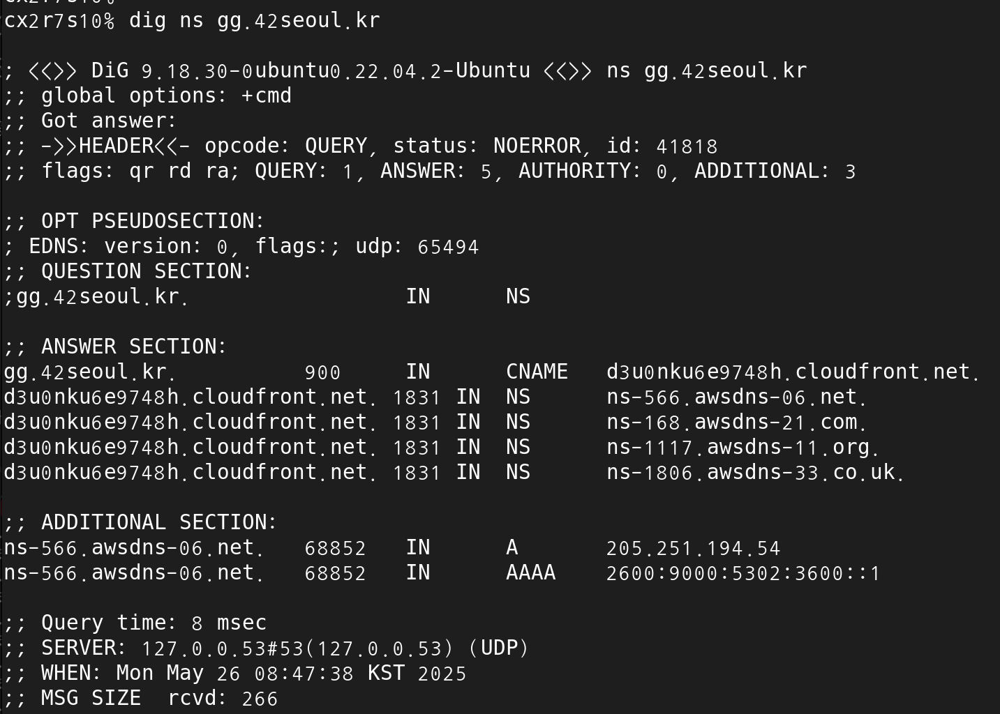
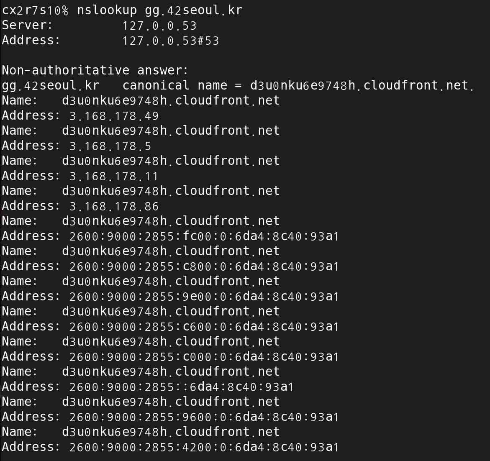

# Chapter 2. 애플리케이션 계층

# 2.1 네트워크 애플리케이션의 원리

## 2.1.1 네트워크 애플리케이션 구조

애플리케이션 구조는 OSI 7계층과 다르다.

- 클라이언트 - 서버 구조(client-server architecture)
    - 항상 동작하고 있는 Host = Server
    - 가끔, 항상 켜져있는 Host = client
    - 특징
        - 클라이언트는 서로 직접적으로 통신하지 않는다.
        - 서버가 고정 IP 주소를 가진다.
        - ex) 웹, 파일 전송, 원격 로그인, 전자 메일
    - 데이터 센터(data center)
        - 한 서버가 모든 요청을 처리할 수 없으므로 가상의 서버를 생성
        - 하나의 데이터 센터는 약 10만개의 서버를 가짐, 이용료를 받음
- P2P 구조(peer-to-peer architecture)
    - peer 라는 호스트 쌍이 서로 직접 통신하게 함.
        - peer : 사용자의 컴퓨터
    - ex) 비트토렌트
    - 특징
        - 자가 확장성 : 토렌트에서 작업 부하를 여러명의 피어에게 분배함으로서 서비스 능력 상승
        - 비용 효율적 : 서버 인프라 스트럭처와 서버 대역폭 X
    - 보안, 성능, 신뢰성 면에서 이슈가 있음.

## 2.1.2 프로세스 간 통신

운영체제 용어에서 실제 통신하는 것은 프로그램이 아닌 프로세스

프로세스(process) :종단 시스템에서 실행하는 프로그램

- 같은 종단 시스템에서 실행될 때
    - 종단 시스템의 OS에 따라 다름
- 다른 종단 시스템에서 실행될 때
    - 컴퓨터 네트워크를 통한 메시지 교환으로 통신
    - 클라이언트 프로세스
        - 통신을 초기화(다른 프로세스와 세션을 시작하려고 접속을 초기화
    - 서버 프로세스
        - 세션을 시작하기 위해 접속을 기다리는 프로세스

위 내용은 p2p 관계에서도 통용된다.

### 프로세스와 컴퓨터 네트워크 사이의 인터페이스

- 소켓
    - 애플리케이션 계층과 트랜스포트 계층 간의 인터페이스
    - 애플리케이션과 네트워크 사이의 API(Application Programming Interface)
    - 개발자는 소켓의 애플리케이션 계층에 대한 모든 통제권을 갖지만, 트랜스포트 계층에 대한 통제권은 거의 갖지 못함
        - 트랜스포트 프로토콜 선택
        - 최대 버퍼와 최대 세그먼트 크기 같은 매개변수

### 프로세스 주소 배정

수신 프로세스를 식별하기 위한 두가지 정보

1. 호스트의 주소(IP 주소)
2. 목적지 호스트 내의 수신 프로세스를 명시하는 식별자(포트 번호)

포트 번호(port number) : 한 호스트가 많은 네트워크 애플리케이션을 수행할때, 구별하기 위해 필요하다. 자주쓰는 번호는 특정 포트가 할당됨

## 2.1.3 애플리케이션이 이용 가능한 트랜스포트 서비스

트랜스포트 계층이 제공(보장)하는 서비스 4가지

1. 신뢰적 데이터 전송(reliable data transfer)
    1. 패킷은 컴퓨터 네트워크에서 손실 가능성이 있음
        1. 를 프로토콜이 막아줍니다.
    2. 손실 허용 애플리케이션(loss-tolerant application)
        1. ex) 실시간 오디오/비디오 → 품질이 떨어지지만 실시간임
2. 처리율
    1. 두 프로세스 간의 통신 세션에서 송신 프로세스가 수신 프로세스로 비트를 전달할 수 있는 비율
    2. 대역폭 민감 애플리케이션(bandwidth-sensitive application)
        1. 인터넷 전화 → 늦게오면 서비스가 성립이 안됨
    3. 탄력적 애플리케이션(elastic application)
        1. 메일, 파일 전송, 웹 전송 → 늦게와도 서비스가 가능
3. 시간
    1. 시간 보장(timing guarantee) : N ms 안에 도착시켜드림
    2. 실시간 상호작용 애플리케이션에 효과적임
        1. 전화, 온라인 게임, 회의 등
4. 보안
    1. 기밀성(confidentiality)
        1. 데이터 암호화
    2. 데이터 무결성(integrity)
    3. 종단인증(authentication)
        1. 8장에서 다시 봐요

## 2.1.4 인터넷 전송 프로토콜이 제공하는 서비스

인터넷은 애플리케이션에게 2개의 전송 프로토콜(UDP, TCP)를 제공

1. TCP 서비스
    1. 연결 지향형 서비스
        1. 핸드 셰이킹 과정
            1. 클라이언트와 서버가 서로 전송 제어 정보를 교환하게 함. → 패킷 받을 준비 해
        2. TCP연결 완료, 전이중 상태(full-duplex, 동시에 메시지를 서로 보낼 수 있는 상태)
    2. 신뢰적인 데이터 전송 서비스
        1. 한 쪽이 바이트 스트림을 소켓으로 전달하면, 그 바이트 스트림이 손실되거나 중복되지 않게 수신 소켓으로 전달
    3. 혼잡 제어 방식
        1. 각 TCP연결이 네트워크 대역폭을 공평하게 공유하게 제한
        2. 네트워크가 혼잡해지면 프로세스 속도를 낮춤
2. UDP 서비스
    1. 비 연결형 서비스
        1. 핸드 셰이킹 없습니다.
    2. 비 신뢰적 서비스
        1. 메시지 도착 보장 안합니다.
        2. 메시지 순서 바뀔수도 있습니다.
    3. 혼잡 제어 없습니다.
        1. 데이터를 원하는 속도로 하위계층으로 보낼 수 있다.
        2. 물론 중간 링크에서 제한되거나 혼잡으로 인해 작아질 수 있음
- 인터넷 트랜스포트 프로토콜이 제공하지 않는 서비스
    1. 인터넷 전화는 속도가 빠르면 좋으니까 UDP를 쓰는데, 방화벽에서 대다수의 UDP를 차단하게 설정됨.
    2. 그럼 애플리케이션 딴에서 TCP로 보냄

## 2.1.5 애플리케이션 계층 프로토콜

종단 시스템에서 실행되는 어플리케이션의 프로세스가 서로 메시지를 보내는 방법을 정의함.

- 교환 메시지 타입(ex : 요청 메시지와 응답 메시지)
- 여러 메시지 타입의 문법(ex : 메시지 내부의 필드와 필드 간 구별법)
- 필드의 의미(ex : name은 이름이에요 성이에요?)
- 언제, 어떻게 프로세스가 메시지를 전송하고 응답하는지 결정하는 규칙

네트워크 애플리케이션의 한 종류일 뿐입니다.

ex) 웹(HTTP), FTP(파일 송수신), 전자메일, DNS, 비디오 스트리밍, P2P

# 2.2 웹과 HTTP

1990년대 초, 월드 와이드웹 등장

- 온 - 디맨드 방식
    - 사용자가 원할때 수신이 가능함(라디오, TV처럼 기다릴 필요 X)
- 개인이 웹상에 어떠한 정보를 사용하게 만들기 쉬움
- 웹과 관련 프로토콜
    - 모바일 인터넷 애플리케이션을 위한 플랫폼 제공
    - 유튜브, 이메일, 인스타, 구글 지도 등

### 2.2.1 HTTP(HyperText Transfer Protocol) 개요

웹의 애플리케이션 계층 프로토콜

클라이언트 프로그램, 서버 프로그램으로 구현

서로 다른 종단 시스템에서 수행되는 클라이언트와 프로그램은 HTTP메시지를 교환하여 통신함

- 웹 페이지
    - 객체로 구성됨(ex : HTML, JPEG, GIF, CSS 등)
    - HTML 파일은 페이지 내부의 다른 객체를 URL로 참조함

```json
http://www.naver.com/index.html
http:// < 프로토콜
www.naver.com < 호스트 이름
/index.html < 경로

*** TMI ***
URL, URN, URI

URL (Uniform Resource Locator) (주소 + 프로토콜)
위치 + 접근 방법을 포함한 식별자
ex) http://www.naver.com/index.html

URN (Uniform Resource Name) (고유 이름)
위치는 모름, 이름으로 식별 함
ex) urn:isbn:978-3-16-148410-0

URI (Uniform Resource Identifier) (전부 다)
```

- HTTP는 TCP를 전송 프로토콜로 사용
- HTTP는 비상태 프로토콜(stateless protocol)
    - 서버는 클라이언트에 관한 어떠한 상태 정보도 저장안함(새로고침하면 걍 다시 보냄)
    - 대신 쿠키랑 세션에 저장함

## 2.2.2 비지속 연결과 지속 연결

RTT(round-trip time) : 작은 패킷이 클라이언트 → 서버 → 클라이언트 까지 걸리는 시간

```json
*** TMI ***

클라이언트 → 서버 : SYN(동기화)
나 연결 시켜줘~

서버 → 클라이언트 : SYN + ACK(응답)
SYN을 받고, OK 응답을 클라이언트 한테 보내줌

클라이언트 -> 서버 : ACK
SYN + ACK에 대한 OK 응답을 다시 서버로 보냄.

이렇게 3번의 패킷 교환을 3-way handshake 라고 함.
```

- 비지속 연결 : 요구 / 응답 이 다른 TCP 연결임
    - HTTP
        - 객체 개수만큼 TCP 버퍼를 할당해야함
        - 객체 하나당 3-way handshake 발생
        - 객체 하나당 2RTT + 객체 전송 시간
- 지속 연결 : 요구 / 응답이 같은 TCP 연결임
    - 디폴트 값임.
    - HTTP
        - TCP 연결을 유지해야해서 많은 요청을 받으면 서버가 힘듬(연결은 일정 기간 사용하지 않으면 닫음)
        - 파이프라이닝(pipelining) 지원
            - 하나의 연결에서 여러 개의 요청을 연속적으로 보내고, 서버가 순서대로 응답을 반환하는 방식.
            - 단, 응답은 반드시 요청 순서대로 와야 하므로, 한 요청의 응답이 늦어지면 뒤의 응답도 지연되는 단점(Head-of-Line Blocking)

## 2.2.3 HTTP 메시지 포맷

책 내용과는 다르게 서술하겠습니다.

```json
POST /login HTTP/1.1           ← 시작 라인(제목)
Host: www.example.com          ← 헤더(부가 정보)
Content-Type: application/json ← 헤더
                               ← 빈 줄(구분선)
{ "id": "abc", "pw": "1234" }  ← 본문(내용)
```

### HTTP 메서드

GET → 정보 주세요

POST → 정보 등록해주세요

PUT → 전부 다 바꿔주세요(내용을 전부 보내야 함!)

PATCH → 이것만 바꿔주세요(바꿀 것만 보내면 됨!)

DELETE → 지워주세요

### HTTP 응답 상태 코드

200 → OK

201 → Created

400 → Bad Request

```json
*** TMI ***

401 → Unauthorized : 로그인을 안했을때
403 → Forbidden : 로그인은 했는데, 권한이 없을때.
```

404 → Not Found

500 → Internal Server Error → 비상!

## 2.2.4 사용자와 서버간의 상호작용: 쿠키

비상태 프로토콜인 HTTP의 한계를 보완하기 위해 사용

HTTP 응답 메시지에 Set-cookie: 헤더를 같이 보냄

HTTP 요청 메시지에 Cookie: 헤더를 같이 보냄

로그인 유지, 비 로그인 장바구니 등에 사용

## 2.2.5 웹 캐싱

웹 서버 대신 HTTP 요구를 충족시키는 네트워크 개체(책 발췌)

웹 캐시는 자체 저장 디스크를 갖고, 최근 호출된 객체의 사본을 저장

1. 브라우저가 웹 캐시와 TCP 연결을 하고, HTTP 요청을 보냄
2. 있으면 웹 캐시가 HTTP 응답 메시지와 객체를 보냄
3. 없으면 웹 캐시가 서버로 TCP 연결을 하고 객체를 받아옴
4. 웹 캐시가 객체를 저장하고 HTTP응답과 객체를 보냄

캐시는 서버이자 클라이언트이다.

(대충 네트워크에 캐시를 추가하면 좋다는 내용)

캐시 히트 → 0.2 ~ 0.7 정도.

캐싱된 정보 최신화 해주는 조건부 GET (헤더에 If-Modified-Since : 포함)

## 2.2.6 HTTP/2

1.  프레이밍(Framing)

데이터를 작은 조각(프레임)으로 쪼개서 전송

바이너리 형식으로 인코딩되어 더 빠르고 효율적으로 처리됨

1. 멀티플렉싱(Multiplexing)

프레이밍 덕분에 여러 요청과 응답의 프레임이 하나의 연결(TCP) 위에서 (인터리빙, 여러개 보내기) 동시에 오갈 수 있음

1. 메시지 우선순위화와 서버 푸싱
- 우선순위화 : 각 요청에 중요도를 부여해, 서버가 더 중요한 리소스(예: 화면에 바로 보여야 하는 이미지)를 먼저 전송함
- 서버 푸시 : 서버가 클라이언트의 요청에 앞으로 필요할 것 같은 리소스(예: CSS, JS 파일)를 미리 보내 성능을 높임

### HTTP/3

3장에서 설명한대요

## 2.3 인터넷 전자 메일

책 내용을 많이 축약했습니다.

1. 사용자가 메일 프로그램으로 메일을 써서 보냄
2. 인터넷을 통해 상대방의 메일 서버로 전달함
    1. SMTP(Simple Mail Transfer Protocol) 사용
        1. HELO, MAIL FROM, RCPT TO, DATA 등등
3. 상대방의 메일 서버에 저장됨
4. 상대방이 메일 프로그램으로 메일을 읽음
    1. POP3/IMAP(Internet Mail Access Protocol) 사용

# 2.4 DNS: 인터넷의 디렉터리 서비스

DNS(Domain Name System)

- DNS 서버들의 계층 구조로 구현된 분산 DB
- 호스트가 분산 DB로 질의하도록 허락하는 어플리케이션 계층 프로토콜
- BIND(Berkeley Internet Name Domain) 소프트웨어를 수행하는 유닉스 컴퓨터
- DNS프로토콜은 UDP상에서 수행되며, 포트 53

호스트를 구별할 수 있는 식별자

1. Hostname : www.facebook.com, www.google.com
    1. 가변길이의 알파뉴메릭(영숫자)이므로, 라우터가 처리하기 힘듬
2. IP(IP address)

## 2.4.1 DNS가 제공하는 서비스

1. 라우터가 처리하기 편하게 HTTP, SMTP, FTP 등 사용자가 제공한 Hostname을 IP로 변환하는 일을 함
2. 호스트 에일리어싱(host aliasing)
    1. elay1.west-coast.enterprise.com  :  이런 풀 네임을 정식 호스트 네임(canonical hostname)이라고 함
    2. 별칭(alias name): enterprise.com, www.enterprise.com
3. 메일 서버 에일리어싱 (Mail Server Aliasing)
    1. bob@relay1.west-coast.enterprise.com (실제 서버)
    2. 별칭 : bob@enterprise.com
4. 부하 분산 (Load Distribution)
    1. 하나의 도메인에 여러 IP 주소를 등록하고, 여러 서버 사이에 트래픽을 분산하는 기능

## 2.4.2 DNS동작 원리 개요

1. 변환될 호스트 네임을 명시하여 DNS측의 클라이언트를 호출
    1. gethostbyname() 함수를 쓴다네요
2. 사용자 호스트의 DNS는 네트워크에 질의 메세지를 보냄
    1. OS에 내장되어있다고 합니다.
    2. 8.8.8.8, 1.1.1.1 같은 서버로 보낸답니다.
3. 모든 DNS질의와 응답 메시지는 포트 53의 UDP 데이터그램으로 보내짐
4. DNS 응답 메시지를 받아서 호출한 애플리케이션으로 전달

### 문제점

- 서버의 고장 : 네임서버가 고장나면 전체 인터넷이 작동하지 않음
- 트래픽 양 : 단일 DNS서버가 모든 DNS질의를 처리해야함
- 먼 거리의 중앙 집중 DB : 단일 서버는 모든 클라이언트와 가까울 순 없음
- 유지관리 : 단일 DNS서버는 DB가 엄청크고 호스트를 등록하게 갱신도 해야하고 인증 문제도 있음

### 분산 계층 데이터베이스

위의 확장성 문제를 해결하기 위해 DNS는 분산되도록 설계되었으며, 성공한 분산 DB의 사례다.

- Root DNS서버
    - (2020년 기준) 천개 넘음, 13개의 루트 서버 복사체, 12개의 기관이 관리
    - TLD서버의 IP주소를 제공함
- TLD(top-level domain, 최상위 레벨 도메인) 서버
    - com, org, ent, edu, gov 같은 상위 도메인과 kr, uk, fr, ca, jp등 국가 상위 레벨 도메인에 대한 TLD 서버(서버 클러스터)
    - 책임 DNS서버의 IP를 제공함
- 책임 DNS 서버
    - 인터넷에서 접근하기 쉬운 호스트(웹 서버, 메일 서버)를 가진 모든 기관은 호스트 이름을 IP주소로 매핑하는 공개적인 DNS 레코드를 제공해야만 함.
    - 기관은 이 레코드를 갖도록 DNS서버의 구현을 선택하고 비용을 지불함.

### 과정

1. 호스트 네임의 IP주소를 알고 싶음
2. 클라이언트는 루트 서버 중 하나에 접속
3. 루트 서버는 TLD서버 IP주소를 보냄
4. 클라이언트는 TLD서버 중 하나에 접속하고, 서버는 도메인을 가진 책임DNS 서버의 IP주소를 보냄
5. 클라이언트는 도메인의 책임 DNS서버 중 하나로 접속
6. 서버는 호스트 네임의 IP주소를 보냄

```json
*** TMI ***

gg.42seoul.kr CNAME(별칭) d3u0nku6e9748h.cloudfront.net
이거

A 레코드 (IPv4)
AAAA 레코드 (IPv6)

AWS에서는 라우터 53에서 관리함.

1. 클라이언트가 gg.42seoul.kr의 IP 주소를 요청
2. 로컬 DNS 서버가 먼저 캐시를 확인, 없으면
3. 루트 DNS 서버에 질의 → .kr TLD 서버의 IP 주소 안내
4. TLD 서버에 질의 → 42seoul.kr의 책임 DNS 서버(NS)의 IP 주소 안내
5. 책임 DNS 서버(42seoul.kr의 NS)에 질의
→ 여기서 gg.42seoul.kr의 CNAME 레코드(d3u0nku6e9748h.cloudfront.net)를 응답

6. 클라이언트는 이제 d3u0nku6e9748h.cloudfront.net의 IP 주소를 구해야 하므로
다시 DNS 질의를 시작
루트 → .net TLD → cloudfront.net의 책임 DNS 서버(NS) →
최종적으로 d3u0nku6e9748h.cloudfront.net의 A/AAAA 레코드(IP 주소)를 받게 됨.
```



### DNS 캐싱

책 발췌 질의 사슬에서 저장할 수 있다 + DNS서버에 저장되고 2일 후 삭제 됨. TLD 서버의 IP를 매핑함

이런식으로 적혀있는데,

퍼플렉시티 피셜

브라우저 → OS → 로컬 DNS 서버 → 권한(책임) DNS 서버 질의사슬순으로 캐싱을 확인한다고 합니다.

## 2.4.3 DNS 레코드와 메시지

DNS 서버들은 자원 레코드(resource record, RR)를 저장한다.

`(Name, Value, Type, TTL)`

TTL → time to live, 캐시 시간

foo.com → 도메인 이름

mail.foo.com → 호스트 이름

Case 1. TYPE=A (relay1.bar.foo.com, 145.37.93.126, A)

- Name : 호스트 이름
- Value : 호스트 이름에 대한 IP를 반환

Case 2. TYPE=NS (foo.com, dns.foo.com, NS)

- Name : 도메인 이름
- Value : 도메인 내부의 호스트 IP 주소를 얻을 수 있는 방법을 아는 책임 DNS서버의 호스트 이름

Case 3. TYPE=CNAME (foo.com, relay1.bar.foo.com, CNAME)

- Name : 호스트 이름
- Value : 정식 호스트 이름

Case 4. TYPE=MX (foo.com, mail.bar.foo.com, MX)

- Name : 도메인 이름
- Value : 해당 도메인으로 온 이메일을 수신할 ****메일 서버의 호스트 이름

책에 적힌대로 썼는데, 위에 틀린점이 좀 있는 것 같습니다.

### DNS 메시지

- Server:	127.0.0.53
    - 로컬에서 사용하는 DNS 서버의 주소(여기서는 127.0.0.53, Linux 시스템의 로컬 DNS 리졸버).
- Address:	127.0.0.53#53
    - DNS 서버의 IP 주소와 포트(53번은 DNS 표준 포트).
- Non-authoritative answer:
    - 이 응답이 공식(권한) DNS 서버가 아니라, 캐시 등에서 온 비공식 응답임을 의미.
- gg.42seoul.kr	canonical name = d3u0nku6e9748h.cloudfront.net.
    - gg.42seoul.kr은 실제로 d3u0nku6e9748h.cloudfront.net이라는 도메인(CNAME)으로 연결됨.
- Name:	d3u0nku6e9748h.cloudfront.net
    
    Address: 3.168.178.49 …..
    
    - cloudfront.net 도메인이  대한 IPv4 주소(A 레코드)와 IPv6 주소(AAAA 레코드).
    

IP 주소 엄청 많은 이유

아래 2.6 단원 콘텐츠 분배 네트워크에서 서술



# 2.5 P2P 파일 분배

2P(피어 투 피어) 방식에서는 중앙 서버에만 의존하지 않고, 파일을 받은 사용자(피어)들이 서로 파일 조각(청크)을 주고받으며 파일을 분배

서버-클라이언트 모델은 서버가 모든 클라이언트에 파일을 직접 전송해야 하므로 서버에 부하가 집중되고, 사용자 수가 많아질수록 분배 시간이 선형적으로 증가하는 반면,

P2P 모델에서는 각 피어가 받은 파일 조각을 다른 피어에게도 업로드하므로, 전체 네트워크의 업로드 용량이 늘어나고, 분배 시간이 훨씬 짧아짐

대표적인 예로 BitTorrent가 있으며, 피어들은 희소한 청크부터 우선적으로 받고, 업로드 속도가 빠른 피어끼리 서로 파일을 주고받으며 효율적으로 분배함

# 2.6 비디오 스트리밍과 콘텐츠 분배 네트워크

비디오 스트리밍은 많은 사용자가 동시에 영상을 요청할 때, 한 서버가 모든 요청을 처리하면 트래픽 과부하와 지연이 발생

CDN(콘텐츠 분배 네트워크)를 사용해서 전 세계 여러 지역(엣지 서버)에 콘텐츠 복사본을 저장해두고, 사용자가 가장 가까운 서버에서 빠르게 콘텐츠를 받을 수 있게 함

사용자는 웹사이트(예: 넷플릭스)에 접속해 원하는 영상을 고르면, 매니페스트 파일을 받아 각 비디오 조각(chunk)이 어디에 있는지 확인하고, 가까운 CDN 서버에서 해당 chunk를 받아 스트리밍

- 매니페스트란 ? 스트리밍 영상의 전체 구조(품질, 해상도, 각 조각의 위치, 오디오 트랙 등)를 기술한 텍스트 파일(주로 .m3u8, .mpd 확장자)

이 구조는 서버 부하 분산, 지연 감소, 대규모 동시 접속에 효과적임.

# 2.7 소켓 프로그래밍 : 네트워크 애플리케이션 생성

1. 서버는 소켓을 생성하고, IP와 포트를 바인딩(bind)한 뒤, 연결 요청을 기다림(listen/accept).
2. 클라이언트는 소켓을 생성하고, 서버의 IP와 포트로 연결(connect)함
3. 연결이 성립되면, 양쪽에서 데이터를 송수신(send/recv)할 수 있습니다.

TCP(신뢰성 보장)와 UDP(빠른 전송, 신뢰성 없음)

그리고 실제로 만드는 실습은 생략하겠습니다.